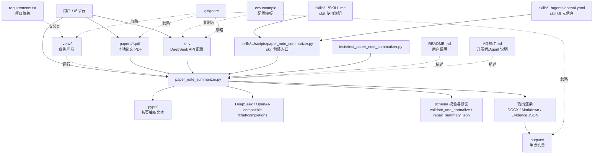
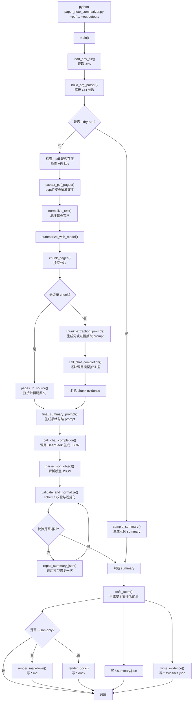
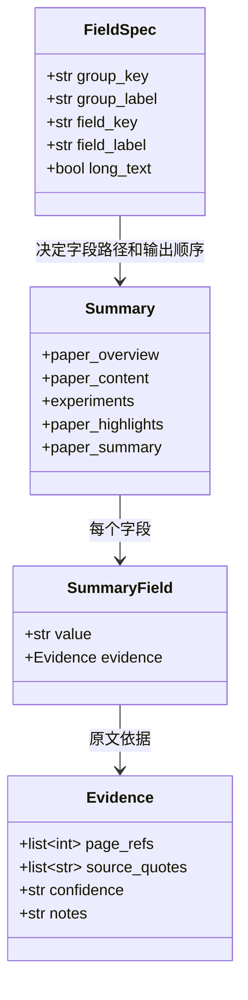
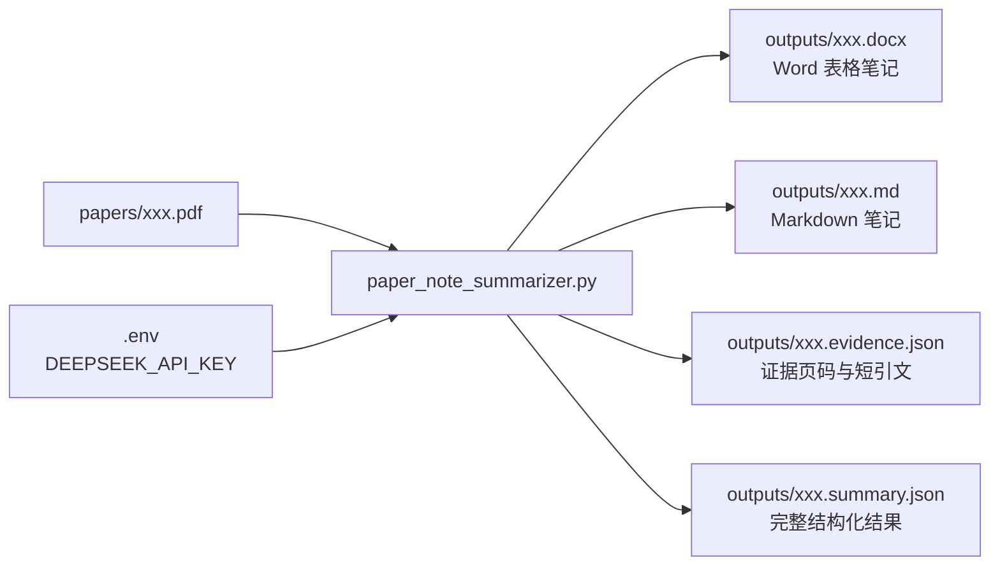

# 项目文件说明与调用关系

本文档说明本项目每个文件的作用，以及它们在“读取论文 PDF -> 调用 DeepSeek -> 生成论文笔记”流程中的交互关系。

## 文件作用

| 文件/目录 | 作用 | 是否直接运行 |
|---|---|---|
| `paper_note_summarizer.py` | 项目主程序。负责读取 `.env`、解析命令行参数、抽取 PDF 文本、调用 DeepSeek/OpenAI-compatible API、校验模型 JSON、生成 DOCX/Markdown/evidence JSON。 | 是 |
| `.env.example` | DeepSeek 配置模板。复制为 `.env` 后填写真实 API key。 | 否 |
| `.env` | 本地真实配置文件，保存 `DEEPSEEK_API_KEY`、`DEEPSEEK_BASE_URL`、`DEEPSEEK_MODEL`。已被 `.gitignore` 忽略，不会提交。 | 否 |
| `requirements.txt` | Python 依赖列表，包括 `pypdf`、`python-docx`、`requests`。 | 否 |
| `README.md` | 面向用户的使用说明，包含安装、配置 DeepSeek、运行命令和输出文件说明。 | 否 |
| `AGENT.md` | 面向下次 Codex/开发者快速接手的项目记忆，记录关键文件、常用命令、实现要点和 Git 注意事项。 | 否 |
| `ARCHITECTURE.md` | 当前文件。说明文件职责、模块调用关系和流程图。 | 否 |
| `.gitignore` | 忽略本地敏感配置、虚拟环境、输出文件、缓存和论文 PDF，避免误提交。 | 否 |
| `papers/.gitkeep` | 保留 `papers/` 目录结构。真实论文 PDF 放在 `papers/` 下，但 `papers/*.pdf` 被忽略。 | 否 |
| `skills/paper-note-summarizer/SKILL.md` | Codex skill 使用说明。告诉 Codex 什么时候触发该 skill、如何运行脚本、如何检查 evidence。 | 否 |
| `skills/paper-note-summarizer/agents/openai.yaml` | skill 的 UI 元信息，包括显示名、简短描述和默认提示词。 | 否 |
| `skills/paper-note-summarizer/scripts/paper_note_summarizer.py` | skill 包装脚本。它不实现总结逻辑，只定位项目根目录主程序并通过 `runpy` 执行。 | 是 |
| `tests/test_paper_note_summarizer.py` | 单元测试。验证 schema 校验、Markdown/evidence 输出、分块页码保持和 `.env` 读取优先级。 | 是 |
| `.venv/` | 本地虚拟环境。安装项目依赖，已被忽略。 | 否 |
| `outputs/` | 程序输出目录，保存 `.docx`、`.md`、`.evidence.json`、`.summary.json`，已被忽略。 | 否 |

## 文件关系图



## 主程序内部调用流程



## 数据结构关系



## 运行时输入输出



## 典型调用方式

普通 CLI 调用：

```bash
.venv/bin/python paper_note_summarizer.py \
  --pdf "papers/论文文件名.pdf" \
  --out outputs
```

skill 包装调用：

```bash
.venv/bin/python skills/paper-note-summarizer/scripts/paper_note_summarizer.py \
  --pdf "papers/论文文件名.pdf" \
  --out outputs
```

两种方式最终都会执行项目根目录的 `paper_note_summarizer.py`，因此输出行为一致。
